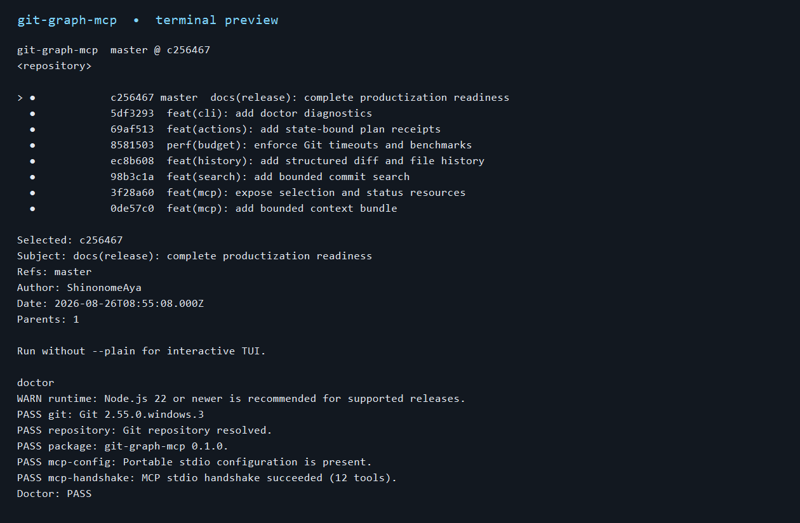

# git-graph-mcp

**语言：** 简体中文 | [English](README.en.md)

一个本地优先的 Git 提交图终端工具，同时提供标准 MCP stdio 服务。它让人
在终端选择提交或范围，再让 Claude Code、Codex、Cursor 等 MCP 客户端读取
同一份受预算约束的 Git 上下文。



## 能做什么

- 在终端查看提交图、分支、提交详情和工作区状态；
- 保存 commit、range、ref 选择，并在 CLI/TUI/MCP 之间复用；
- 通过 MCP 读取 graph、status、context、search、diff、history 和 resources；
- 生成安全的分支动作与 reset 预览，不自动执行 reset/checkout/push；
- 用 `doctor` 检查 Node.js、Git、仓库、MCP 配置和 stdio 握手。

## 快速开始

要求：Git 在 `PATH` 中，正式支持 Node.js 22+。

```powershell
npm ci
node .\bin\git-graph-mcp.js graph --plain --limit 8
node .\bin\git-graph-mcp.js doctor
```

交互式 TUI：

```powershell
node .\bin\git-graph-mcp.js graph
```

常用操作：

```powershell
node .\bin\git-graph-mcp.js status
node .\bin\git-graph-mcp.js search --limit 20
node .\bin\git-graph-mcp.js select commit <commit-oid>
node .\bin\git-graph-mcp.js selected
node .\bin\git-graph-mcp.js doctor --json
```

目标仓库不是当前目录时，为命令追加 `--repo <path>`。

## MCP 配置

仓库根目录的 `.mcp.json` 使用本地 stdio：

```json
{
  "mcpServers": {
    "git-graph": {
      "type": "stdio",
      "command": "node",
      "args": ["./bin/git-graph-mcp.js", "mcp"]
    }
  }
}
```

服务器提供 12 个有界工具和两个只读 resources：
`git-graph://default/selection`、`git-graph://default/status`。MCP stdout
只保留协议消息；诊断信息写入 stderr，且不会回显仓库路径、配置值或请求内容。

## 安全边界

默认工作流是只读的。分支创建要求显式调用、不会移动已有分支；reset 只生成
预览，`git_revalidate_plan` 会在动作前校验仓库状态指纹。项目不启动网络监听器，
也不上传仓库内容。

## 开发与发布

```powershell
npm run check
npm run test:package-install
```

更多内容：

- [五分钟 Demo](docs/DEMO.md)
- [能力与测试证据](CAPABILITY_MAP.md)
- [贡献指南](CONTRIBUTING.md)
- [安全策略](SECURITY.md)
- [发布清单](docs/RELEASE_CANDIDATE.md)
